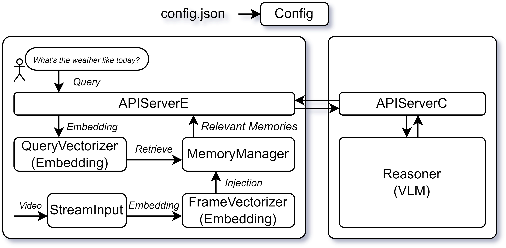

# 代码结构
## 代码模块

<p align='center'></p>
# 视频记忆查询系统

一个基于多进程架构的视频内容理解和检索系统，支持从视频流中提取帧、向量化、记忆管理和自然语言查询。

## 项目结构

```
HelloWorld/
├── README.md                 # 项目说明文档
├── main.py                   # 主启动入口
├── requirements.txt          # 依赖包列表
├── configs/
│   └── config.json          # 系统配置文件
├── src/                     # 源代码目录
│   ├── main.py             # 客户端主程序
│   ├── stream_input.py     # 视频流输入模块
│   ├── frame_vectorizer.py # 帧向量化模块
│   ├── query_vectorizer.py # 查询向量化模块
│   ├── memory_manager.py   # 记忆管理模块
│   ├── api_server_e.py     # 边端API服务器
│   ├── reasoner.py         # 推理模块（云端）
│   └── api_server_c.py     # 云端API服务器
├── demo/                    # 演示数据
│   ├── 1.json
│   └── assets/
│       ├── bicycle.mp4
│       └── cooking.mp4
├── models/                  # 模型文件
│   └── 1.json
└── resource/               # 资源文件
    ├── docs/
    │   └── contribution.md
    ├── icon/
    └── image/
        └── workflow.png
```

## 代码模块

目前的需求：

- 把每个模块按进程独立运行

在客户端(边端)把整个系统按阶段分为：

1. **StreamInput**: 负责从视频流中提取帧. 给FrameVectorizer提供帧数据. 视频流可以是摄像头的实时视频流, 也可以用本地的视频文件模拟视频流. 根据Config中的参数, 支持不同的FPS. 提供一个进程, 负责从视频流中提取帧, 并把提取到的帧发送给FrameVectorizer.

2. **FrameVectorizer**: 负责把提取到的帧转换为某种语义向量(用作记忆模块的语义索引)和时间索引, 给MemoryManager提供向量数据. 根据Config中的参数, 可以选择不同的编码模型, 比如ViT; 也可以选择不同的提取策略, 比如每帧提取一个向量, 还是每n帧提取一个向量(此时要记录关键帧位置), 还是Early-exit策略; 也可以选择使用小型VLM, 提取这些视觉tokens的KVCache均值. 提供一个进程, 负责从StreamInput接收帧数据(进行机内进程间通讯), 并把提取到的向量发送给MemoryManager.

3. **QueryVectorizer**: 负责把用户的自然语言查询转换为某种语义向量(用作记忆模块的查询索引), 给MemoryManager提供向量数据. 根据Config中的参数, 可以选择不同的编码模型; 提供一个进程, 负责从APIServerE接收查询数据(进行机内进程间通讯), 并把提取到的向量发送给MemoryManager.

4. **MemoryManager**: 负责把FrameVectorizer提供的向量和原始视频注入到记忆模块中, 同时根据QueryVectorizer提供的查询向量进行检索相关记忆. 记忆模块可以是特征向量的数据库, 也可以是图结构的数据库, 还是Hierarchical的数据库. 根据Config中的参数, 可以选择不同的记忆模块. 至于检索策略, 可以选择基于向量相似度的检索, 也可以选择基于图结构的检索, 取决于记忆模块的种类. 提供两个进程, 一个负责接收向量并注入记忆(与客户端的FrameVectorizer进行机内通讯), 一个负责接收查询检索记忆(与客户端的QueryVectorizer、APIServerE进行机内通讯)

5. **APIServerE**: 边端API服务器负责提供API接口, 用于接收用户请求, 从云端接收Reasoner的流式结果并返回给用户. 用户通过APIServerE发起自然语言查询, 客户端根据查询的文本, 先发送至QueryVectorizer进行向量化, 然后发送到MemoryManager中提取相关记忆(根据Config中的参数, 可以返回关键帧或关键帧的上下文), 然后把用户的查询文本和提取到的记忆一同发送给服务器端的APIServerC. 提供一个进程. 

在服务器端(云端)把整个系统按阶段分为：
1. **Reasoner**: 接收查询数据, 使用大型VLM进行推理, 流式生成发给服务器端的APIServerC. 提供一个进程, 负责从APIServerC接收数据, 交给Reasoner进行流式推理, 并把推理结果发送给APIServerC.
2. **APIServerC**: 负责接收客户端的查询文本和提取到的记忆给Reasoner, 负责接收Reasoner的流式结果, 并把结果返回给客户端的APIServerE. 提供一个进程, 负责从APIServerE接收数据(进行机外通讯), 并把Reasoner流式数据发送给客户端.
## 快速开始

### 1. 安装依赖

```bash
conda create -n video python=3.10
conda activate video
pip install -r requirements.txt
```

### 2. 配置系统

编辑 `configs/config.json` 文件，根据需要调整各模块参数：

- 视频源配置（摄像头/文件路径）
- 模型选择（ViT、VLM等）
- FPS设置
- 记忆模块类型
- API端口配置

### 3. 运行系统

#### 启动客户端（边端）
```bash
python src/main.py
```

#### 启动服务器端（云端）
```python
from src.api_server_c import APIServerC
server = APIServerC()
server.start()
```

### 4. 使用API

发送查询请求到边端API服务器：
```bash
curl -X POST http://localhost:8000/query \
  -H "Content-Type: application/json" \
  -d '{"query": "视频中有什么有趣的内容？"}'
```

## 核心功能

### 客户端模块（边端）

1. **StreamInput** (`stream_input.py`)
   - 从视频流（摄像头/文件）提取帧
   - 支持可配置FPS
   - 多进程架构，使用队列管理帧数据
   - 提供帧数据给FrameVectorizer

2. **FrameVectorizer** (`frame_vectorizer.py`)
   - 将视频帧转换为语义向量
   - 支持多种编码模型（ViT、VLM等）
   - 灵活的提取策略（每帧、每n帧、Early-exit）
   - 进程间通信接收帧数据

3. **QueryVectorizer** (`query_vectorizer.py`)
   - 将自然语言查询转换为语义向量
   - 可配置的编码模型
   - 与APIServerE通信接收查询

4. **MemoryManager** (`memory_manager.py`)
   - 管理视频记忆的存储和检索
   - 支持多种数据库类型（向量、图、层次结构）
   - 双进程架构：存储进程和检索进程
   - 基于相似度或图结构的检索策略

5. **APIServerE** (`api_server_e.py`)
   - 边端API服务器
   - 接收用户查询请求
   - 协调QueryVectorizer和MemoryManager
   - 与云端APIServerC通信

### 服务器端模块（云端）

1. **Reasoner** (`reasoner.py`)
   - 大型VLM推理引擎
   - 流式生成响应
   - 处理查询文本和相关记忆

2. **APIServerC** (`api_server_c.py`)
   - 云端API服务器
   - 接收客户端查询和记忆数据
   - 协调Reasoner进行推理
   - 流式返回结果到客户端

## 技术特性

- **多进程架构**：每个模块独立运行，提高系统稳定性
- **进程间通信**：使用Queue进行高效数据传输
- **模块化设计**：松耦合架构，易于扩展和维护
- **配置驱动**：通过JSON配置文件灵活调整系统行为
- **流式处理**：支持实时视频流处理和响应
- **RESTful API**：标准HTTP接口，易于集成

## 配置说明

主要配置项位于 `configs/config.json`：

```json
{
  "stream_input": {
    "video_source": "camera",  // 或 "file"
    "video_path": "demo/assets/cooking.mp4",
    "fps": 30
  },
  "frame_vectorizer": {
    "model": "vit",
    "strategy": "every_frame"
  },
  "query_vectorizer": {
    "model": "text_encoder"
  },
  "memory_manager": {
    "type": "vector_db",
    "retrieval_strategy": "similarity"
  },
  "api_server": {
    "host": "localhost",
    "port": 8000
  }
}
```

## 问题


## 奇思妙想
- 固定镜头的视频, 可不可以由边端执行top-k tokens的选择, 然后交由服务器端执行稀疏attention？
- 服务器端执行的稀疏attention, 其top-k tokens的信息是不是可以反过来指导记忆的存取？
- 按场景执行不同的帧采样
目前的需求：

- 把每个模块按进程独立运行

在客户端(边端)把整个系统按阶段分为：

1. **StreamInput**: 负责从视频流中提取帧. 给FrameVectorizer提供帧数据. 视频流可以是摄像头的实时视频流, 也可以用本地的视频文件模拟视频流. 根据Config中的参数, 支持不同的FPS. 提供一个进程, 负责从视频流中提取帧, 并把提取到的帧发送给FrameVectorizer.

2. **FrameVectorizer**: 负责把提取到的帧转换为某种语义向量(用作记忆模块的语义索引)和时间索引, 给MemoryManager提供向量数据. 根据Config中的参数, 可以选择不同的编码模型, 比如ViT; 也可以选择不同的提取策略, 比如每帧提取一个向量, 还是每n帧提取一个向量(此时要记录关键帧位置), 还是Early-exit策略; 也可以选择使用小型VLM, 提取这些视觉tokens的KVCache均值. 提供一个进程, 负责从StreamInput接收帧数据(进行机内进程间通讯), 并把提取到的向量发送给MemoryManager.

3. **QueryVectorizer**: 负责把用户的自然语言查询转换为某种语义向量(用作记忆模块的查询索引), 给MemoryManager提供向量数据. 根据Config中的参数, 可以选择不同的编码模型; 提供一个进程, 负责从APIServerE接收查询数据(进行机内进程间通讯), 并把提取到的向量发送给MemoryManager.

4. **MemoryManager**: 负责把FrameVectorizer提供的向量和原始视频注入到记忆模块中, 同时根据QueryVectorizer提供的查询向量进行检索相关记忆. 记忆模块可以是特征向量的数据库, 也可以是图结构的数据库, 还是Hierarchical的数据库. 根据Config中的参数, 可以选择不同的记忆模块. 至于检索策略, 可以选择基于向量相似度的检索, 也可以选择基于图结构的检索, 取决于记忆模块的种类. 提供两个进程, 一个负责接收向量并注入记忆(与客户端的FrameVectorizer进行机内通讯), 一个负责接收查询检索记忆(与客户端的QueryVectorizer、APIServerE进行机内通讯)

5. **APIServerE**: 边端API服务器负责提供API接口, 用于接收用户请求, 从云端接收Reasoner的流式结果并返回给用户. 用户通过APIServerE发起自然语言查询, 客户端根据查询的文本, 先发送至QueryVectorizer进行向量化, 然后发送到MemoryManager中提取相关记忆(根据Config中的参数, 可以返回关键帧或关键帧的上下文), 然后把用户的查询文本和提取到的记忆一同发送给服务器端的APIServerC. 提供一个进程. 

在服务器端(云端)把整个系统按阶段分为：
1. **Reasoner**: 接收查询数据, 使用大型VLM进行推理, 流式生成发给服务器端的APIServerC. 提供一个进程, 负责从APIServerC接收数据, 交给Reasoner进行流式推理, 并把推理结果发送给APIServerC.
2. **APIServerC**: 负责接收客户端的查询文本和提取到的记忆给Reasoner, 负责接收Reasoner的流式结果, 并把结果返回给客户端的APIServerE. 提供一个进程, 负责从APIServerE接收数据(进行机外通讯), 并把Reasoner流式数据发送给客户端.
## 问题


## 奇思妙想
- 固定镜头的视频, 可不可以由边端执行top-k tokens的选择, 然后交由服务器端执行稀疏attention？
- 服务器端执行的稀疏attention, 其top-k tokens的信息是不是可以反过来指导记忆的存取？
- 按场景执行不同的帧采样